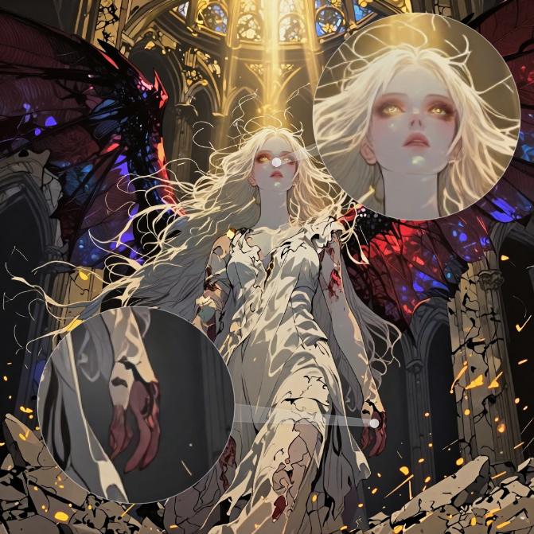
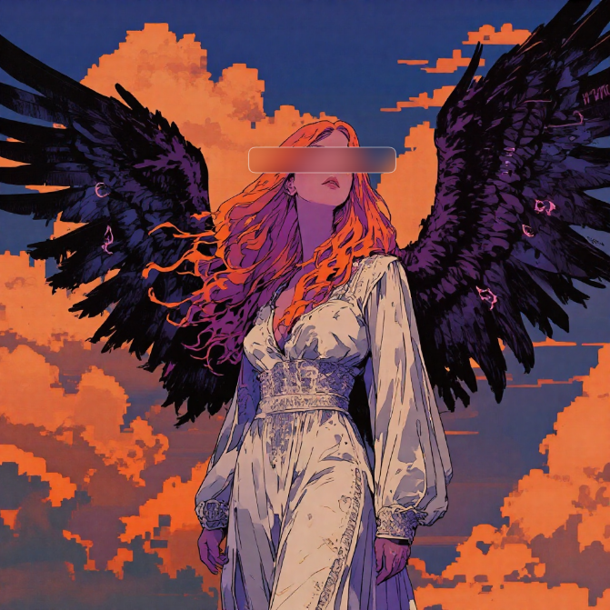

# Pixel Blur

Interactive image workspace built with Next.js, TypeScript, and Bun. Blur regions, magnify areas, or drop stickers on top of your images. Terminus font provides a consistent UI look.

| Magnify | Blur |
| --- | --- |
|  |  |

## Prerequisites

- [Bun](https://bun.sh/) installed

## Scripts

- `bun run dev` – start the dev server at [http://localhost:3000](http://localhost:3000)
- `bun run build` – create an optimized production build
- `bun run start` – run the production server
- `bun run lint` – lint the codebase

## Getting Started

```bash
bun install
bun run dev
```

Open [http://localhost:3000](http://localhost:3000) to use the app.

## Project Notes

- Assets live in `assets/` and `public/`. The favicon is `public/icon.svg`.
- UI font is loaded locally from Terminus (`src/app/fonts.ts`).
- Undo is supported (Ctrl/Cmd+Z) for lens/sticker actions.
